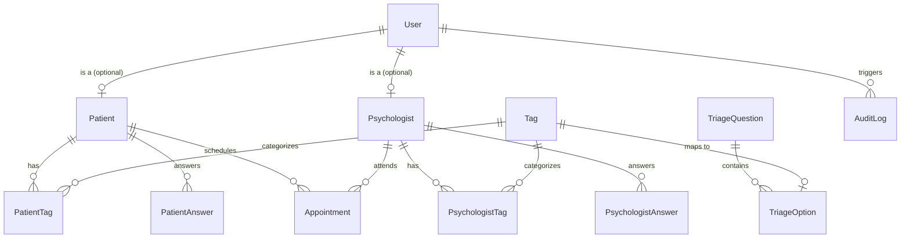

# Mapa de Entidades — HopeMind (Padrão Prottus)

O modelo de dados do **HopeMind** é construído no banco PostgreSQL com Prisma ORM. Todas as tabelas e colunas utilizam a linguagem **Inglês** no banco de dados e no backend, mantendo o frontend (interface do usuário) em **Português**.

---

## Entidades Principais

---

## Dicionário de Tabelas

### 1. `users`
Cadastros base de autenticação do sistema (Pacientes ou Psicólogos).

| Coluna | Tipo | Descrição |
|--------|------|-----------|
| `id` | UUID / Int (PK) | Identificador único do usuário |
| `email` | String (Unique) | E-mail corporativo/pessoal |
| `password_hash` | String | Hash seguro PBKDF2/Bcrypt |
| `name` | String | Nome completo |
| `cpf` | String (Unique) | Cadastro de Pessoa Física |
| `phone` | String | Telefone de contato |
| `birth_date` | Date | Data de nascimento |
| `gender` | String | Gênero |
| `user_type` | Enum (`PATIENT`, `PSYCHOLOGIST`, `ADMIN`) | Papel do usuário no sistema |
| `is_active` | Boolean | Status do cadastro (Ativo/Inativo) |
| `created_at` | Timestamp | Data de cadastro |
| `updated_at` | Timestamp | Última alteração |

---

### 2. `patients`
Dados específicos do perfil de paciente.

| Coluna | Tipo | Descrição |
|--------|------|-----------|
| `id` | UUID / Int (PK) | Identificador do perfil de paciente |
| `user_id` | FK -> `users.id` | Vínculo com a conta de usuário |
| `main_complaint` | Text | Queixa principal / motivo da busca |

---

### 3. `psychologists`
Dados específicos do perfil profissional.

| Coluna | Tipo | Descrição |
|--------|------|-----------|
| `id` | UUID / Int (PK) | Identificador do perfil de psicólogo |
| `user_id` | FK -> `users.id` | Vínculo com a conta de usuário |
| `crp` | String (Unique) | Registro profissional CRP |
| `contact_link` | String | Link de agendamento/WhatsApp |
| `specialty` | String | Especialidade principal (ex: TCC, Psicanálise) |
| `therapeutic_approach` | String | Abordagem terapêutica |
| `biography` | Text | Breve biografia / resumo profissional |
| `session_fee` | Decimal | Valor por sessão (R$) |

---

### 4. `tags`
Categorias de características, abordagens e preferências de triagem.

| Coluna | Tipo | Descrição |
|--------|------|-----------|
| `id` | UUID / Int (PK) | Identificador da Tag |
| `code` | String (Unique) | Código da Tag (ex: `ANXIETY`, `DEPRESSION`, `CBT`) |
| `name` | String | Nome legível em português |
| `category` | String | Categoria da Tag |

---

### 5. `triage_questions` & `triage_options`
Questionário dinâmico de triagem.

- `triage_questions`: `id`, `target_audience` (`PATIENT`, `PSYCHOLOGIST`, `BOTH`), `question_text`, `order`
- `triage_options`: `id`, `question_id` (FK), `tag_id` (FK opcional), `option_text`

---

### 6. `patient_tags` & `psychologist_tags`
Tabelas de relacionamento de tags identificadas na triagem para cálculo de % de Match.

---

### 7. `appointments`
Agendamento de sessões entre pacientes e psicólogos.

| Coluna | Tipo | Descrição |
|--------|------|-----------|
| `id` | UUID / Int (PK) | Identificador da sessão |
| `psychologist_id` | FK -> `psychologists.id` | Psicólogo responsável |
| `patient_id` | FK -> `patients.id` | Paciente agendado |
| `appointment_date` | Timestamp | Data e hora marcada |
| `status` | Enum (`SCHEDULED`, `COMPLETED`, `CANCELLED`) | Status da sessão |
| `created_at` | Timestamp | Registro |

---

### 8. `audit_logs`
Logs de auditoria e segurança.

| Coluna | Tipo | Descrição |
|--------|------|-----------|
| `id` | BigInt / Int (PK) | Registro de auditoria |
| `entity_name` | String | Tabela modificada |
| `entity_id` | String | ID do registro afetado |
| `action` | String | Ação (`INSERT`, `UPDATE`, `DELETE`, `LOGIN`) |
| `payload` | JSON | Dados anteriores / novos |
| `user_id` | FK -> `users.id` | Autor da ação |
| `created_at` | Timestamp | Momento do evento |
