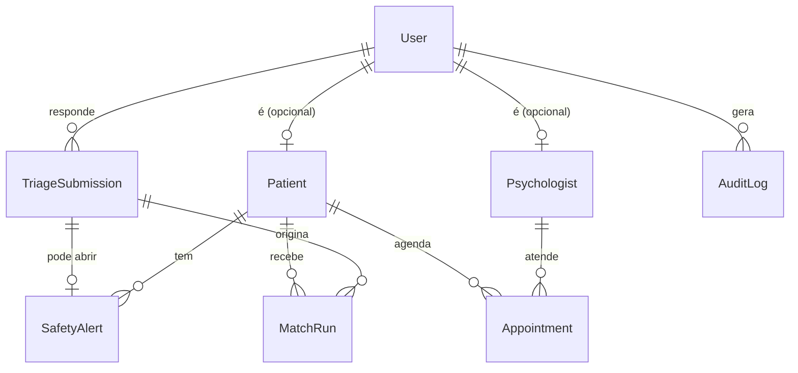

# Mapa de Entidades — HopeMind

Banco **MariaDB / MySQL** com Prisma ORM (`backend/prisma/schema.prisma`). Tabelas e colunas em **inglês**; interface em **português**. DDL de referência: [`database/sql/hopemind_schema.sql`](../../database/sql/hopemind_schema.sql).

---

## Entidades

As **perguntas** dos questionários não ficam no banco: elas são definidas em código (`backend/src/triage/questionnaire/`) e versionadas pelo git, como pede a seção 12 do documento de requisitos. Cada resposta registra a versão do questionário respondido.

---

## Dicionário de tabelas

### 1. `users`
Conta de acesso (paciente, psicólogo ou admin).

| Coluna | Tipo | Descrição |
|--------|------|-----------|
| `id` | Int (PK) | Identificador |
| `email` | String (único) | E-mail de login |
| `password_hash` | String | Hash bcrypt |
| `name` | String | Nome completo |
| `cpf` | String (único) | CPF (somente dígitos) |
| `phone` | String | Celular (somente dígitos) |
| `birth_date` | Date | Nascimento — define a faixa etária no filtro do match |
| `gender` | String | Gênero — usado só se o paciente declarar preferência (P17) |
| `user_type` | Enum `PATIENT` · `PSYCHOLOGIST` · `ADMIN` | Papel |
| `is_active` | Boolean | Conta ativa |
| `created_at` / `updated_at` | DateTime | Auditoria |

### 2. `patients`
| Coluna | Tipo | Descrição |
|--------|------|-----------|
| `id` | Int (PK) | Perfil do paciente |
| `user_id` | FK → `users.id` | Conta |
| `main_complaint` | Text | Queixa principal (texto livre, opcional) |

### 3. `psychologists`
| Coluna | Tipo | Descrição |
|--------|------|-----------|
| `id` | Int (PK) | Perfil profissional |
| `user_id` | FK → `users.id` | Conta |
| `crp` | String (único) | Registro no Conselho Regional de Psicologia |
| `specialty` | String | Especialidade exibida no perfil |
| `therapeutic_approach` | String | Abordagem exibida no perfil |
| `biography` | Text | Apresentação |
| `session_fee` | Decimal | Valor da sessão (R$) |
| `contact_link` | String | Link de contato (opcional) |

### 4. `triage_submissions`
Cada envio de questionário. O mais recente de cada usuário é o perfil vigente; os anteriores ficam como histórico.

| Coluna | Tipo | Descrição |
|--------|------|-----------|
| `id` | Int (PK) | Envio |
| `user_id` | FK → `users.id` | Quem respondeu |
| `audience` | Enum `PATIENT` · `PSYCHOLOGIST` | Qual questionário |
| `questionnaire_version` | String | Ex.: `hm-paciente-2026.1` |
| `answers` | JSON | Respostas por código (`P01`, `S06`…), já validadas |
| `safety_level` | Enum `NONE` · `WANTS_TALK` · `ELEVATED` · `IMMEDIATE` | Resultado do fluxo de segurança (P26/P27) |
| `created_at` | DateTime | Momento do envio |

### 5. `safety_alerts`
Aberto quando o paciente indica risco. **Não influencia o ranking** — serve para acompanhamento pela equipe clínica.

| Coluna | Tipo | Descrição |
|--------|------|-----------|
| `id` | Int (PK) | Alerta |
| `patient_id` | FK → `patients.id` | Paciente |
| `submission_id` | FK → `triage_submissions.id` (único) | Envio que originou |
| `level` | Enum (mesmo de `safety_level`) | Gravidade |
| `status` | Enum `OPEN` · `ACKNOWLEDGED` · `RESOLVED` | Acompanhamento |
| `created_at` / `resolved_at` | DateTime | Datas |

### 6. `match_runs`
Registro de cada recomendação entregue, para auditoria e comparação entre versões do algoritmo.

| Coluna | Tipo | Descrição |
|--------|------|-----------|
| `id` | Int (PK) | Execução |
| `patient_id` | FK → `patients.id` | Paciente |
| `submission_id` | FK → `triage_submissions.id` | Respostas usadas |
| `algorithm_version` | String | Ex.: `hm-match-1.0.0` |
| `questionnaire_version` | String | Versão do questionário |
| `results` | JSON | Psicólogos, score e componentes |
| `created_at` | DateTime | Momento |

### 7. `appointments`
| Coluna | Tipo | Descrição |
|--------|------|-----------|
| `id` | Int (PK) | Sessão |
| `psychologist_id` | FK → `psychologists.id` | Profissional |
| `patient_id` | FK → `patients.id` | Paciente |
| `appointment_date` | DateTime | Data e hora (sessões de 50 min, sem sobreposição) |
| `status` | Enum `SCHEDULED` · `COMPLETED` · `CANCELLED` | Situação |

### 8. `audit_logs`
| Coluna | Tipo | Descrição |
|--------|------|-----------|
| `id` | BigInt (PK) | Registro |
| `entity_name` / `entity_id` | String | Registro afetado |
| `action` | String | Ação |
| `payload` | JSON | Dados |
| `user_id` | FK → `users.id` | Autor |
| `created_at` | DateTime | Momento |
